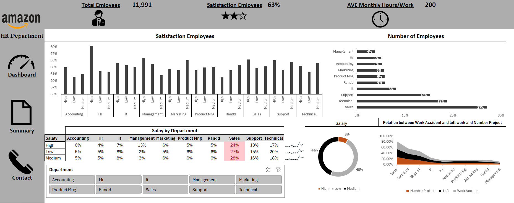

# HR Data Dashboard

📊 This is my first dashboard created in Excel as part of my data analysis learning journey.  
It shows employee distribution by department and promotion statistics.  

**Tools used:** Excel (Pivot Tables, Charts, Data Cleaning)

